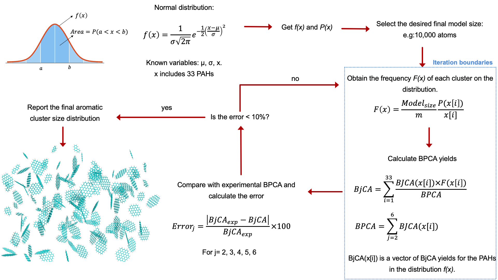

### Figure 3. Methodology to obtain the aromatic cluster size distribution from BPCA experimental data and the initial normal distribution for the molecular weight. Example for cellulose biochar at 600°C. 

