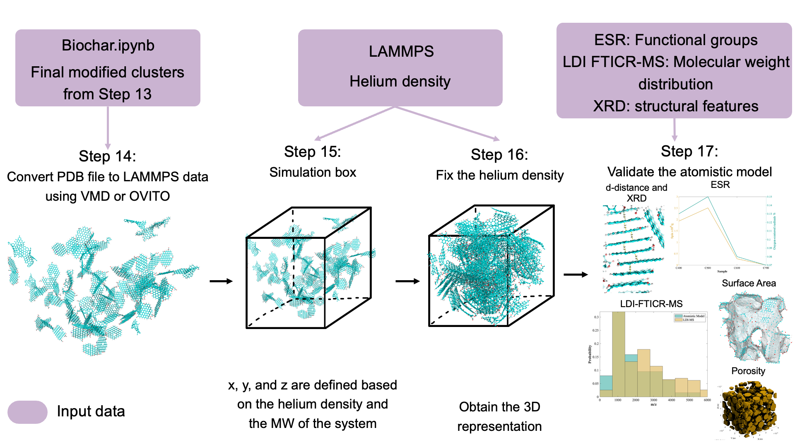

# Biochar Atomistic Models
This new approach, implemented in Python and visualized using PyMOL, considers chemical constraints and characterization data. It incorporates polyaromatic structures and ring defects, randomly assigns functional groups and radicals, creates a cross-linked network between clusters, and captures porosity at a large-scale molecular level. Figure 1 illustrates this approach.

### Figure 1. Methodology to interpret characterization data and obtain atomistic representations of biochar. 
*Randomly select n-molecules to include the n-functional groups needed. Molecules can be selected multiple times, except for the inclusion of holes. 
Modifications are sequentially illustrated for the same molecule, but the process involves randomly selecting the molecule for each step. 

The structures are in a well-dispersed grid during construction stages to prevent molecule overlap and facilitate modification. After the cross-linking, the grid is reconstructed to place all the molecules closer, mimicking a gas phase. As a result, the final coordinates of the modified clusters are converted from a Protein Data Bank (PDB) file to a Large-scale Atomic/Molecular Massively Parallel Simulator (LAMMPS) data file with an atom-style charge, and the file conversion is carried out using OVITO; see Figure 6. LAMMPS is used to construct an MD-generated biochar representation

### Figure 2. Approach to obtain the 3D representation of biochar. 

LAMMPS is used to construct a molecular dynamics-based biochar model. The simulation employs a canonical ensemble (NVT) at 298 K to mimic a compression process by reducing the simulation box size by < 1% in each time step until the target density is achieved. The temperature ensures a nonreactive environment by preventing bonds from breaking and forming. The C/H/O/N force field is applied with a 0.07 fs timestep.

###  [How to use it?](https://www.youtube.com/watch?v=V4YJs-slrXk)

