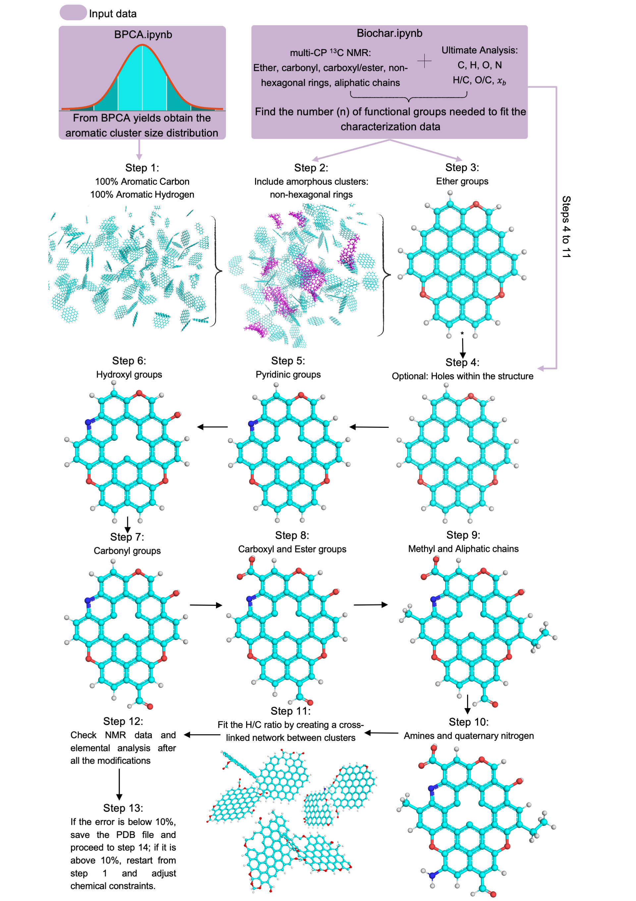

# Biochar Atomistic Models
This new approach, implemented in Jupyter Notebook and visualized using PyMOL, considers chemical constraints and characterization data. It incorporates polyaromatic structures and ring defects, randomly assigns functional groups and radicals, creates a cross-linked network between clusters, and captures microporosity at a large-scale molecular level. Figure 1 illustrates the methodology employed.


### Figure 1. Methodology to interpret characterization data and obtain atomistic representations of biochar. 
*Randomly select n-molecules to include the n-functional groups needed. Molecules can be selected multiple times, except for the inclusion of holes. 
Modifications are sequentially illustrated for the same molecule, but the process involves randomly selecting the molecule for each step. 

During construction stages, the structures are in a well-dispersed grid to prevent molecule overlap and facilitate modification. After the cross-linking, the grid is reconstructed to place all the molecules closer, mimicking a gas phase. As a result, the final coordinates of the modified clusters are converted from a Protein Data Bank (PDB) file to a Large-scale Atomic/Molecular Massively Parallel Simulator (LAMMPS) data file with an atom-style charge, and the file conversion is carried out using OVITO. 


### Figure 2. Approach to obtain the 3D representation of biochar. 

LAMMPS is used to construct a molecular dynamics-based biochar model. We employed a canonical ensemble (NVT) at 298 K to mimic a compression process by reducing the simulation box size by < 1% in each time step until the target density is achieved. The temperature ensures a nonreactive environment by preventing bonds from breaking and forming. The C/H/O/N force field is applied with a 0.07 fs timestep.

You can use any other tool, methodology, or force field to obtain the 3D representation from the PBD file obtained after running Biochar.ipynb 

> [!NOTE]
> To construct the atomistic representation, you require, at a minimum, the characterization data from the ultimate analysis, <sup>13</sup>C NMR (quantitative), helium density, and BPCA yields. To validate the atomistic representation, you can use any characterization technique that gives information about the atomistic structure at the molecular level.

> [!IMPORTANT]
> Version used: Python 3.10.13 and PyMOL 2.5.5. The code is applicable for molar ratios of O/C ≤ 0.217 and H/C ≤ 0.627 and elemental composition including C, H, N, and O. 

### How to install it?

```
git clone https://github.com/BiocharModeling/BiocharAtomisticModels
cd BiocharAtomisticBuilder
```
- Install PyMol (https://github.com/schrodinger/pymol-open-source?tab=readme-ov-file)
- Connect PyMol to Jupyter Notebook (https://pymolwiki.org/index.php/Jupyter)

###  [How to run it? :computer:](https://www.youtube.com/watch?v=V4YJs-slrXk)

### Contributing :bulb:
We welcome your collaboration and input to help us enhance this project. Please contact us if you have improvements or modifications to suggest or if you encounter any issues running the code. We're here to work together and resolve any problems you may face.

### Contact us :email:
**Email**: 
[Valentina Sierra](mailto:v.sierrajimenez@wsu.edu) <br>
**Address:** <br>
Biological Systems Engineering <br>
Washington State University <br> 
Pullman, WA, USA

This research used resources from the Center for Institutional Research Computing at Washington State University.

If you use any of the models or data published here, please cite:
Sierra-Jimenez, V., Mathews, J. P., Yoo, P., Budai, A., Chejne, F., Dufour, A., & Garcia-Perez, M. (2024). Biochar data into structure: A methodology for generating large-scale atomistic representations. Carbon, 228, 119391. https://doi.org/10.1016/j.carbon.2024.119391
