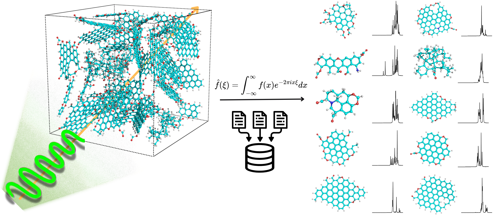

# Spectral Database – User Guide
This folder contains interactive HTML notebooks that present the theoretical spectra (IR, Raman, C/H NMR, 2D NMR, and XPS) of representative molecular structures relevant to biochar.
The database is intended for visual exploration: you can zoom, pan, toggle spectra on/off, and read peak positions directly in the browser.

## 🔎 How to Open
1. Download or clone the repository.  
2. Navigate to the `Spectral Database/` folder.  
3. Open the `BiocharSpectralDatabase.html` file with your web browser (Chrome, Firefox, Safari, or Edge).  
4. Alternatively, you can access it directly here:  

👉 [View Biochar Spectral Database](https://BiocharModeling.github.io/BiocharAtomisticModels/Spectral%20Database/BiocharSpectralDatabase.html)

## Navigation Inside the HTML
The HTML file is organized with an **interactive table of contents**:

- At the top of the page, you will find clickable links for each section (IR, Raman, NMR, 2D NMR, XPS).  
- Clicking on a link will automatically scroll to the corresponding spectral plots.  
- Each section includes multiple spectra that you can zoom, pan, and hover over for details.  
- At the end of each section, there is a **“Back to top”** button. Clicking it will return you to the main table of contents, so you can easily jump to another spectral category without manual scrolling.

This design allows quick navigation between different types of spectra without losing your place.

## Note on Data Access
The HTML files are meant for **visual comparison and inspection only**.  
They do **not** include raw machine-readable spectral arrays.  

If you are interested in raw numerical datasets, please contact:  
[Valentina Sierra](mailto:v.sierrajimenez@wsu.edu)  

## Citation
If you use this database, please cite:  
Sierra-Jimenez, V., Chejne, F., & Garcia-Perez, M. (2025). First principles and neural network-driven biochar spectral database: Raman, XPS, IR, and NMR. FlatChem, 100960. https://doi.org/10.1016/j.flatc.2025.100960
